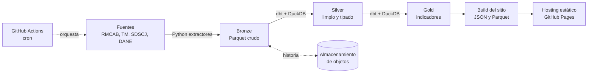

# Observatorio Bacatá — Especificación de requerimientos

Versión 0.1 (borrador) · 24 sep 2026 · Diego Pardo Montero

> Esta copia en el repositorio es la fuente de verdad. Si algo cambia, se cambia aquí, en un PR.

## 1. Visión y propósito

El Observatorio Bacatá es un sitio público y gratuito que convierte los datos abiertos de Bogotá en visualizaciones claras, actualizadas y comparables por localidad. Es un proyecto cívico: su éxito se mide en si un vecino, un periodista o un estudiante entiende su ciudad mejor que antes, no en cuánta técnica muestra.

**Problema.** Los datos existen, pero están dispersos entre entidades (Secretaría de Ambiente, TransMilenio, Secretaría de Seguridad, DANE), en formatos distintos y sin contexto. Responder "¿cómo está el aire en mi localidad este mes?" exige descargar archivos, limpiarlos y cruzarlos.

**Propuesta de valor.** Una sola puerta, con cuatro temas (aire, movilidad, seguridad y costo de vida) y una lente común: la localidad y el tiempo.

**Principios de diseño**

- **Claridad antes que densidad:** cada gráfico responde una pregunta, escrita como título.
- **Transparencia total:** cada cifra muestra su fuente, su fecha de corte y cómo se calculó.
- **Sin estigmas:** los datos sensibles se presentan con contexto y tasas, nunca como rankings de "barrios peligrosos".
- **Costo cero y bajo mantenimiento:** que el proyecto sobreviva sin servidores ni presupuesto.

**Nombre.** Bacatá es el nombre muisca del territorio donde hoy está Bogotá. La identidad visual puede tomar de ahí su paleta y su iconografía (sol, montaña, sabana).

## 2. Usuarios y casos de uso

La persona que manda en las decisiones de diseño es el vecino desde el celular: si él entiende, los demás también.

| Perfil | Pregunta típica | Qué necesita |
| --- | --- | --- |
| Vecino (principal) | ¿Cómo está mi localidad frente al resto de la ciudad? | Buscar su localidad, ver 4 indicadores clave y lenguaje simple, en móvil |
| Periodista | ¿Subieron los hurtos en Chapinero este año? | Series comparables, fecha de corte visible, descargar datos y gráficos con la fuente |
| Estudiante o investigador | ¿Hay relación entre calidad del aire y tráfico? | Datos limpios descargables (CSV/Parquet) y metodología documentada |
| Edil, concejal u organización social | ¿Qué localidad necesita más atención en movilidad? | Comparación entre localidades y tendencias de varios años |

**Historias de usuario clave (v1)**

1. Como vecino, quiero escribir el nombre de mi localidad y ver su ficha con los cuatro temas, para entender cómo está en 30 segundos.
2. Como vecino, quiero saber si hoy el aire es bueno o malo cerca de mí, para decidir si salgo a correr.
3. Como periodista, quiero descargar la serie y el gráfico de un indicador con su fuente y fecha, para citarlos en una nota.
4. Como investigador, quiero descargar el dataset limpio y leer cómo se construyó, para reutilizarlo.

## 3. Alcance y fases

Los cuatro temas entran al proyecto, pero se publican uno por uno. Cada fase termina con algo público y usable, y la base común (localidades, calendario, pipeline, sitio) se construye una sola vez en la Fase 1.

| Fase | Tema | Por qué en este orden | Estimado |
| --- | --- | --- | --- |
| 1 | Calidad del aire + base común | Datos horarios, poco sensibles y muy visuales. Obliga a construir toda la plataforma | 4–5 semanas |
| 2 | Movilidad | Mucho volumen (validaciones) y flujos animados. Reutiliza el mapa y la dimensión localidad | 3–4 semanas |
| 3 | Seguridad | El tema más sensible: llega cuando ya hay reglas de presentación probadas (sección 9) | 3 semanas |
| 4 | Costo de vida | Datos menos granulares por zona. Cierra la ficha de localidad | 2–3 semanas |

Los estimados suponen dedicación parcial (tardes y fines de semana) y están por validar.

**Fuera de alcance en v1**

- Cuentas de usuario, comentarios o datos aportados por ciudadanos.
- Predicciones o modelos de machine learning: primero describir bien, después predecir.
- Granularidad por barrio o UPZ: la unidad base es la localidad (20 en Bogotá).
- Otros municipios de la Sabana.
- App móvil nativa: el sitio web responsive es suficiente.

## 4. Fuentes de datos

Hay datos suficientes para los cuatro temas, pero con calidades muy distintas. Seguridad está por localidad y al día, pero publica acumulados del año y no meses, y sus archivos no cuadran entre sí en varios hurtos (ADR 0002). Aire tiene la mejor resolución, pero no tiene API documentada. Movilidad está al día en siniestros y validaciones (ADR 0006). Costo de vida tiene huecos que hay que resolver antes de su fase.

| Tema | Fuente y proveedor | Granularidad | Frecuencia / cobertura | Formato | Licencia | Estado |
| --- | --- | --- | --- | --- | --- | --- |
| Base | [Localidad. Bogotá D.C.](https://datosabiertos.bogota.gov.co/dataset/localidad-bogota-d-c) — Secretaría de Planeación | Polígonos por localidad (EPSG 4686) | Datos de 2022, sin actualización periódica | GeoJSON, GPKG, SHP, WFS | CC BY 4.0 | Listo |
| Aire | [RMCAB — datos de monitoreo por hora](http://rmcab.ambientebogota.gov.co/Report/HourlyReports) — Secretaría de Ambiente | 20 estaciones; PM10, PM2.5, O3, CO, NO2, SO2 y meteorología | Horaria | Reportes web, sin API ni exportación documentada | Por confirmar | Riesgo: requiere extracción del portal |
| Aire | [Estaciones y promedios anuales](https://datosabiertos.bogota.gov.co/dataset?organization=sda&tags=Calidad+del+aire) — Secretaría de Ambiente | Ubicación de estaciones; PM10 y ozono anual | Anual (último corte 2024) | GeoJSON, SHP, WFS | Datos Abiertos Bogotá | Listo (complemento) |
| Movilidad | [Validaciones SITP](https://datosabiertos-transmilenio.hub.arcgis.com/documents/2085b5a41a0243c7958ebeb36911bb1a) — TransMilenio | Cada validación (crudos) o estación, acceso e intervalo de 15 min (XLSX mensual) | Crudos diarios con un día de retraso; XLSX mensual hasta ago. 2026 | ZIP con CSV y XLSX en un bucket público de Google Cloud | Contradictoria (CC BY o CC BY-SA 4.0) | Al día. Los crudos pesan unos 80 GB al año: se usará el XLSX mensual ([ADR 0006](decisiones/0006-fuentes-de-movilidad.md)) |
| Movilidad | [Validaciones mensuales por franja horaria](https://datosabiertos.bogota.gov.co/dataset/validaciones-mensuales-del-sitp-por-franja-horaria) — TransMilenio | Apunta al mismo bucket de las validaciones | Mensual. La fecha de dic. 2024 es la de los metadatos de CKAN, no la de los archivos | XLSX | CC BY-SA 4.0 | Al día ([ADR 0006](decisiones/0006-fuentes-de-movilidad.md)) |
| Movilidad | [Siniestralidad (SIGAT)](https://datos.movilidadbogota.gov.co/search?tags=siniestralidad) — Secretaría de Movilidad | Víctima y siniestro, con localidad y tipo de actor | Diaria, con unos 3 días de retraso; los dos últimos meses se siguen digitando. Útil desde 2021 (de 2007 a 2020 hay registros duplicados) | ArcGIS REST (FeatureServer) | No declarada (los demás datos de la SDM son CC BY 4.0) | Extracción de víctimas desde 2021 ([ADR 0006](decisiones/0006-fuentes-de-movilidad.md)). Reemplaza al histórico de Datos Abiertos Bogotá, que llega a 2021 |
| Seguridad | [Delito de Alto Impacto](https://datosabiertos.bogota.gov.co/dataset/delito-de-alto-impacto-bogota-d-c) — Secretaría de Seguridad | Por localidad; acumulado del año a la fecha (no mensual), 11 delitos | Se reemplaza cada mes. Acumulado ene.–ago. de 2018 a 2026 y años completos de 2018 a 2025 | GeoJSON, GPKG, SHP, WFS, REST | CC BY-SA 4.0 | Extracción lista. Inconsistencias en hurtos por aclarar con la SDSCJ ([ADR 0002](decisiones/0002-extraccion-delito-alto-impacto.md)) |
| Costo de vida | [IPC](https://www.dane.gov.co/index.php/estadisticas-por-tema/precios-y-costos/indice-de-precios-al-consumidor-ipc/) — DANE | Ciudad (Bogotá entre 38 ciudades), 12 divisiones de gasto | Mensual, base 2018 | XLSX (anexos) | DANE | Listo, pero sin detalle por localidad |
| Costo de vida | [Encuesta Multipropósito](https://microdatos.dane.gov.co/index.php/catalog/743) — SDP y DANE | Hogar, representativa por localidad | Cada 3–4 años (última con microdatos: 2021) | Microdatos | DANE | Por explorar |

**Población por localidad y año:** proyecciones y retroproyecciones 2005-2035 del DANE y la Secretaría de Planeación (agosto de 2025), que publica la Secretaría de Salud en [Datos Abiertos Bogotá](https://datosabiertos.bogota.gov.co/dataset/piramide-poblacional-bogota-d-c) (CC BY 4.0). Es el denominador de las tasas por 100.000 habitantes ([ADR 0005](decisiones/0005-poblacion-por-localidad.md)).

## 5. Requerimientos funcionales

Son 20 requerimientos en 6 módulos, con prioridad MoSCoW. Los "Debe" de cada tema entran en su fase; los "Debería" pueden quedar para después sin romper nada.

| ID | Módulo | Requerimiento | Prioridad | Fase |
| --- | --- | --- | --- | --- |
| RF-01 | Portada | Muestra un indicador principal por tema para toda la ciudad, con su tendencia frente al periodo anterior y la fecha de corte | Debe | 1 |
| RF-02 | Portada | Buscador de localidad por nombre que lleva a su ficha | Debe | 1 |
| RF-03 | Mapa | Mapa coroplético de las 20 localidades, con selector de tema e indicador | Debe | 1 |
| RF-04 | Mapa | Al tocar una localidad se ve su valor, su posición frente a la mediana de la ciudad y un enlace a su ficha | Debe | 1 |
| RF-05 | Mapa | Control de tiempo para animar el mapa mes a mes | Debería | 2 |
| RF-06 | Ficha de localidad | Una página por localidad con los cuatro temas: valor actual, serie histórica y comparación con la ciudad | Debe | 1–4 |
| RF-07 | Ficha de localidad | Compartir la ficha con un enlace y una imagen de vista previa (Open Graph) | Debería | 2 |
| RF-08 | Aire | Estado actual por estación con categoría de color según el índice IBOCA | Debe | 1 |
| RF-09 | Aire | Serie horaria y diaria de PM2.5 por estación, con límites normativos como referencia | Debe | 1 |
| RF-10 | Aire | Patrón por hora del día y día de la semana (mapa de calor) | Debería | 1 |
| RF-11 | Movilidad | Validaciones por estación y franja horaria, con mapa de calor de estaciones | Debe | 2 |
| RF-12 | Movilidad | Siniestros viales por localidad y tipo de actor (peatón, ciclista, motociclista) | Debe | 2 |
| RF-13 | Seguridad | Tasa de delitos de alto impacto por 100.000 habitantes, por localidad y mes | Debe | 3 |
| RF-14 | Seguridad | Tendencia de cada localidad frente a sí misma, no solo frente a las demás | Debe | 3 |
| RF-15 | Costo de vida | Inflación de Bogotá por división de gasto y comparación con el país | Debe | 4 |
| RF-16 | Costo de vida | Indicadores de la Encuesta Multipropósito por localidad (arriendo, ingreso y gasto de los hogares) | Debería | 4 |
| RF-17 | Datos abiertos | Descargar cada indicador en CSV y el dataset Gold completo en Parquet | Debe | 1 |
| RF-18 | Datos abiertos | Descargar cada gráfico como PNG con fuente y fecha incrustadas | Debería | 2 |
| RF-19 | Metodología | Página por tema con fuentes, transformaciones, fórmulas, limitaciones y fecha de la última carga | Debe | 1 |
| RF-20 | Metodología | Página de estado del pipeline: última ejecución, fuentes con error y datos retrasados | Debería | 1 |

## 6. Requerimientos no funcionales

La restricción que ordena todo es el costo: $0 al mes, sin servidores. De ahí salen el sitio estático y el pipeline por lotes.

| ID | Atributo | Requerimiento medible |
| --- | --- | --- |
| RNF-01 | Costo | $0/mes en infraestructura. Solo se paga el dominio (opcional) |
| RNF-02 | Frescura | Aire: dato más reciente con máximo 3 h de retraso. Demás temas: cargados máximo 48 h después de que la fuente publica |
| RNF-03 | Rendimiento | Portada con LCP menor a 2,5 s en 4G y menos de 1 MB de carga inicial, sin contar teselas del mapa |
| RNF-04 | Móvil | Diseño mobile-first, usable desde 360 px de ancho y sin scroll horizontal |
| RNF-05 | Accesibilidad | WCAG 2.1 AA: paletas seguras para daltonismo, contraste mínimo 4,5:1 y resumen en texto de cada gráfico |
| RNF-06 | Transparencia | Cada cifra visible enlaza a su fuente y muestra su fecha de corte |
| RNF-07 | Calidad de datos | Pruebas dbt (no nulos, rangos, unicidad, frescura) en cada ejecución. Si una prueba crítica falla, no se publica y se conserva la versión anterior |
| RNF-08 | Reproducibilidad | Todo el pipeline corre en local con un solo comando y produce los mismos resultados que en CI |
| RNF-09 | Privacidad | Sin cookies de seguimiento. Analítica opcional, sin cookies y agregada |
| RNF-10 | Licencias | Código bajo MIT. Datos derivados bajo CC BY-SA 4.0, porque varias fuentes son share-alike |
| RNF-11 | Idioma | Español, con lenguaje claro. Los términos técnicos se explican al pasar el cursor o al tocar |

## 7. Arquitectura y stack

Es un pipeline por lotes en GitHub Actions que extrae, transforma con dbt sobre DuckDB y genera un sitio estático. No hay base de datos ni servidor en producción: el navegador solo lee archivos.

GitHub Actions dispara todo con un cron. Como cada ejecución arranca desde cero, la historia de Bronze y Silver se guarda en almacenamiento de objetos entre corridas.

| Capa | Elección | Por qué | Alternativa |
| --- | --- | --- | --- |
| Extracción | Python (httpx, pandas) con un extractor por fuente | Cada fuente es distinta (WFS, XLSX, portal web) | — |
| Transformación | dbt-core + dbt-duckdb | Tests, linaje y documentación gratis. Es el stack del día a día | SQL suelto en DuckDB |
| Motor | DuckDB | Analítico, embebido y lee y escribe Parquet sin servidor | Polars |
| Orquestación | GitHub Actions (cron) | Gratis e ilimitado en repositorios públicos | Prefect Cloud (free tier) |
| Historia entre corridas | Assets de GitHub Releases ([ADR 0004](decisiones/0004-historia-en-github-releases.md)) | Persistencia gratis sin base de datos ni secretos | Cloudflare R2 |
| Sitio | Observable Framework (data loaders en Python, gráficos con Observable Plot) | Pensado para sitios de datos estáticos | Astro + ECharts |
| Mapa | Polígonos GeoJSON dibujados en SVG, sin teselas | Sin proveedor de mapas ni costos. 20 polígonos pesan poco | MapLibre + OpenFreeMap |
| Hosting | GitHub Pages | Gratis y en el mismo lugar que el código | Cloudflare Pages |

**Frecuencias de ejecución propuestas:** aire cada hora; seguridad, movilidad e IPC una vez al día (detecta nuevos cortes y solo recarga si cambió algo).

## 8. Modelo de datos

El corazón del modelo es una tabla Gold única en formato largo, `fct_indicador_localidad_mes`. Cualquier gráfico del sitio es un filtro sobre ella, y agregar un tema nuevo es agregar filas, no tablas.

| Capa | Contenido | Convención | Ejemplos |
| --- | --- | --- | --- |
| Bronze | Copia fiel de la fuente, más la fecha de extracción y un hash del archivo | `brz_<fuente>__<recurso>`, Parquet particionado por fecha de carga | `brz_rmcab__horario`, `brz_sdscj__delito_alto_impacto` |
| Silver | Tipado, nombres homologados, fechas en hora de Bogotá, localidad estandarizada, duplicados fuera | `stg_` (1:1 con Bronze) e `int_` (cruces) | `stg_rmcab__medicion`, `int_estacion_localidad` |
| Gold | Dimensiones conformadas y hechos listos para el sitio | `dim_` y `fct_` | `dim_localidad`, `fct_indicador_localidad_mes` |

**Dimensiones conformadas**

- `dim_localidad`: código oficial, nombre canónico, variantes de nombre para el cruce ("Antonio Nariño" / "ANTONIO NARIÑO" / "Ant. Nariño") y geometría. La población por año va en `dim_localidad_anio` ([ADR 0005](decisiones/0005-poblacion-por-localidad.md)).
- `dim_fecha`: día, mes, año, día de la semana, festivo en Colombia.
- `dim_indicador`: código, nombre para humanos, tema, unidad, dirección (si subir es bueno o malo), fuente y licencia.
- `dim_estacion` (aire): estación RMCAB, coordenadas y localidad.

**Hecho principal:** `fct_indicador_localidad_mes` tiene como llave `localidad_id`, `mes` e `indicador_id`, y como medidas `valor`, `valor_ciudad`, `n_observaciones` y `fecha_corte_fuente`. Aire tiene además un hecho horario por estación (`fct_aire_estacion_hora`) para las vistas de detalle.

## 9. Riesgos, ética y decisiones abiertas

El riesgo técnico más alto es depender de extraer datos del portal RMCAB. El riesgo reputacional más alto es que el tema de seguridad termine estigmatizando localidades. Ambos se atacan desde el diseño, no después.

| Riesgo | Impacto | Mitigación |
| --- | --- | --- |
| El portal RMCAB cambia o bloquea la extracción | Aire se queda sin datos | Extractor aislado con prueba de contrato. Pedir acceso formal o un volcado a la Secretaría de Ambiente. Si falla, el sitio muestra "datos retrasados" |
| Fuentes de movilidad desactualizadas (2021 y 2024) | Fase 2 con datos viejos | Explorar el portal de la SDM y el hub de TransMilenio antes de la fase. Si no hay nada reciente, se publica como histórico y se advierte |
| GitHub desactiva los cron de repos públicos tras 60 días sin actividad | El sitio deja de actualizarse sin avisar | Commit automático de metadatos por ejecución y alerta si no hay corrida en 48 h |
| Asignar estaciones de aire a localidades engaña (hay localidades sin estación) | Conclusiones falsas sobre una zona | Mostrar el aire por estación, no interpolado. Las localidades sin estación dicen "sin medición" |
| Sumapaz (rural, poca población) distorsiona tasas y mapas | Valores extremos que confunden | Tratarla aparte, con una nota visible |

**Reglas de presentación para seguridad**

1. Siempre tasas por 100.000 habitantes, nunca solo conteos absolutos.
2. Sin rankings de "localidades más peligrosas" ni colores alarmistas (nada de rojo sangre).
3. Cada localidad se compara primero consigo misma (tendencia) y después con la ciudad.
4. Nota visible: son delitos registrados, y el subregistro varía entre zonas y tipos de delito.
5. Nada por debajo de localidad: ni puntos ni barrios.

**Decisiones abiertas**

- [ ] ¿Pedir a la Secretaría de Ambiente acceso formal a datos horarios antes de construir el extractor?
- [x] ¿Cloudflare R2 o GitHub Releases para la historia entre corridas? GitHub Releases ([ADR 0004](decisiones/0004-historia-en-github-releases.md))
- [x] ¿Observable Framework o Astro para el sitio? Observable Framework ([ADR 0003](decisiones/0003-sitio-observable-framework.md))
- [x] ¿Qué fuente de población por localidad se usa como oficial? Las proyecciones DANE-SDP de agosto de 2025 ([ADR 0005](decisiones/0005-poblacion-por-localidad.md))
- [ ] ¿Dominio propio (p. ej. bacata.co o similar) o subdominio gratuito al inicio?
- [ ] ¿Cómo se diferencia de observatorios que ya existen, como el de la Secretaría de Movilidad? Propuesta: la vista cruzada de los cuatro temas por localidad
- [x] ¿Aire o seguridad como primer tema publicado? Aire: seguridad necesita población por localidad y su fuente tiene inconsistencias ([ADR 0002](decisiones/0002-extraccion-delito-alto-impacto.md))

## 10. Roadmap y siguientes pasos

Antes de la Fase 1 se hace una Fase 0 de una semana para eliminar los dos riesgos grandes: la extracción de RMCAB y la elección del framework del sitio.

| Etapa | Entregable | Criterio de terminado |
| --- | --- | --- |
| Fase 0 — Exploración (1 semana) | Prueba de extracción de RMCAB y de Delito de Alto Impacto. Prueba de un día con Observable Framework | Un mes de PM2.5 de 3 estaciones en Parquet. Una página con un gráfico desplegada en GitHub Pages |
| Fase 0 — Identidad | Paleta, logo y tipografía de Bacatá | Sistema de diseño aprobado |
| Fase 1a — Plataforma | Repo, estructura dbt, `dim_localidad`, `dim_fecha`, CI con tests, sitio base | Pipeline completo en verde con datos de prueba |
| Fase 1b — Aire | RF-01 a RF-04, RF-06, RF-08, RF-09, RF-17 y RF-19 | Sitio público con aire actualizado cada hora |
| Fases 2 a 4 | Movilidad, seguridad y costo de vida | Según la sección 3 |

## Fuentes consultadas

- [Localidad. Bogotá D.C. — Datos Abiertos Bogotá](https://datosabiertos.bogota.gov.co/dataset/localidad-bogota-d-c)
- [RMCAB — Datos de monitoreo por hora](http://rmcab.ambientebogota.gov.co/Report/HourlyReports)
- [Datasets de calidad del aire de la Secretaría de Ambiente — Datos Abiertos Bogotá](https://datosabiertos.bogota.gov.co/dataset?organization=sda&tags=Calidad+del+aire)
- [Validaciones SITP — Portal de Datos Abiertos de TransMilenio](https://datosabiertos-transmilenio.hub.arcgis.com/documents/2085b5a41a0243c7958ebeb36911bb1a)
- [Validaciones mensuales del SITP por franja horaria — Datos Abiertos Bogotá](https://datosabiertos.bogota.gov.co/dataset/validaciones-mensuales-del-sitp-por-franja-horaria)
- [Histórico Siniestros Bogotá D.C. — Datos Abiertos Bogotá](https://datosabiertos.bogota.gov.co/en/dataset/historico-siniestros-bogota-d-c)
- [Siniestros Viales Consolidados — Datos Abiertos Bogotá](https://datosabiertos.bogota.gov.co/dataset/siniestros-viales-consolidados-bogota-d-c)
- [Delito de Alto Impacto. Bogotá D.C. — Datos Abiertos Bogotá](https://datosabiertos.bogota.gov.co/dataset/delito-de-alto-impacto-bogota-d-c)
- [Índice de Precios al Consumidor (IPC) — DANE](https://www.dane.gov.co/index.php/estadisticas-por-tema/precios-y-costos/indice-de-precios-al-consumidor-ipc/)
- [Encuesta Multipropósito 2021 — Microdatos DANE](https://microdatos.dane.gov.co/index.php/catalog/743)
